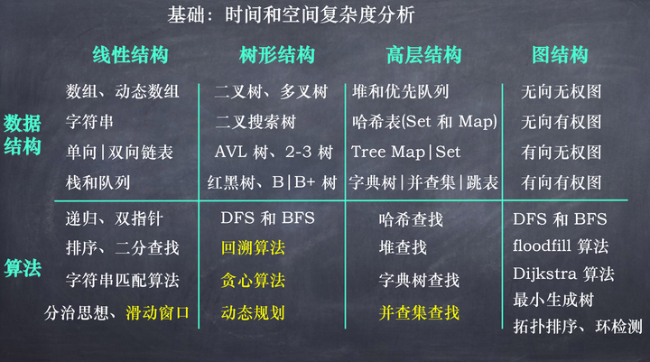

# 机试算法学习

记录算法机试学习路线，提高机试学习效率，不断提高机试代码能力。

## 1 知识点

|   | 知识点 | 
| - | ------- |
|**基础算法**| [双指针](algorithm/双指针.md)、[差分](algorithm/差分.md)、[滑动窗口](algorithm/滑动窗口.md)、[单调栈](algorithm/单调栈.md) |

## 2 题目数据范围分析

由数据范围反推算法复杂度以及算法内容，一般ACM或者笔试题的时间限制是 1 秒或 2 秒。

在这种情况下，C++代码中的操作次数控制在 $10^7~10^8$ 为最佳。下面给出在不同数据范围下，代码的时间复杂度和算法该如何选择：

| 数据范围  | 时间复杂度 | 常用算法 |
| -------  | --------  | -------- |
| $n≤30$   | 指数级别   | dfs+剪枝，状态压缩dp|
| $n≤10^2$  | $O(n^3)$  | floyd，dp，高斯消元|
| $n≤10^3$ | $O(n^2)$、 $O(n²logn)$ | dp，二分，朴素版Dijkstra、朴素版Prim、Bellman-Ford|
| $n≤10^4$  | $O(n∗\sqrt{n})$ | 块状链表、分块、莫队 |
| $n≤10^5$  | $O(nlogn)$ | 各种sort，线段树、树状数组、set/map、heap、拓扑排序、dijkstra+heap、prim+heap、Kruskal、spfa、求凸包、求半平面交、二分、CDQ分治、整体二分、后缀数组、树链剖分、动态树 |
| $n≤10^6$  | 常数较小的 $O(nlogn)$ | 单调队列、 hash、双指针扫描、BFS、并查集，kmp、AC自动机 |
| $n≤10^7$  | $O(n)$ | 双指针扫描、kmp、AC自动机、线性筛素数 |
| $n≤10^9$  | $O(\sqrt{n})$ | 判断质数 |
| $n≤10^{18}$  | $O(logn)$ | 最大公约数，快速幂，数位DP |
| $n≤10^{1000}$  | $O((logn)²)$ | 高精度加减乘除 |
| $n≤10^{100000}$  | $O(logk×loglogk)$ | k表示位数，高精度加减、FFT/NTT |

## 3 学习记录

|序号| 平台 | 题单名称 | 状态 | 完成时间 |
|--| ---- | ------ | ----  | ------ |
|1|[Acwing](acwing/Readme.md)|[算法基础课](acwing/1-算法基础课/)|进行中| |
|2|[Acwing](acwing/Readme.md)|[蓝桥杯每日一题](acwing/2-蓝桥杯每日一题/)|进行中| |
|3|[Acwing](acwing/Readme.md)|[算法竞赛进阶指南](acwing/3-算法竞赛进阶指南/)|进行中| |
|5|[Leetcode](leetcode/)|[Leetcode热题100](leetcode/2-热题100/)|已完成| 2024.07.27 |
|6|[Leetcode](leetcode/)|[动态规划（基础版）](leetcode/3-动态规划（基础版）/)|已完成| 2024.10.08 |
|7|[Leetcode](leetcode/)|[「新」动计划·编程入门](leetcode/6-「新」动计划%20·%20编程入门/)|已完成| 2024.07.23 |
|8|[Leetcode](leetcode/)|[面试经典150题](leetcode/7-面试经典%20150%20题/)|进行中|  |
|9|[Leetcode](leetcode/)|[119经典题变种挑战](leetcode/8-119经典题变种挑战/)|进行中|  |
|10|[Leetcode](leetcode/)|[30天Pandas挑战](leetcode/9-30%20天%20Pandas%20挑战/)|进行中|  |