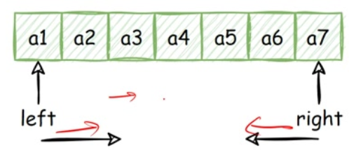
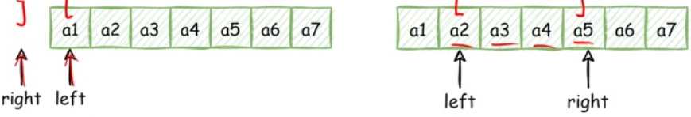

# 1 双指针简介

双指针算法是一种常用的算法技巧，它通常用于在数组或字符串中进行**快速查找、匹配、排序或移动**操作。

**双指针并非真的用指针实现，一般用两个变量来表示下标（在后面都用指针来表示）。**

双指针算法使用两个指针在数据结构上进行迭代，并根据问题的要求移动这些指针。

双指针往往也和**单调性、排序**联系在一起，在数组的区间问题上，暴力法的时间复杂度往往是O(n²)的，但双指针利用“**单调性**”可以优化到O(n)。

常见的双指针模型有：

1. 对撞指针
2. 快慢指针

***

# 2 对撞指针

## 2.1 简介

指的是两个指针**left**、**right**分别指向序列的***第一个元素和最后一个元素***。

然后指针$l$不断递增，指针$r$不断递减，直到两个指针的值相撞或错开（即$l≥r$），或者满足其他要求的特殊条件为止。

对撞指针一般用来解决**有序数组和或者字符串**问题（常见于**区间**问题）：

- 查找有序数组中满足某些约束条件的一组元素问题：比如**二分查找**、**数字之和**等问题。
- 字符串反转问题：**反转字符串、回文数、颠倒二进制**等问题。

## 2.2 求解步骤

1. 使用两个指针$left$、$right$。$left$指向序列第一个元素，即：$left=1$，$right$指向序列最后一个元素，即：$right=n$
2. 在循环体中将左右指针相向移动，当满足一定条件时，将左指针右移（$left+1$）。当满足另外一定条件时，将右指针左移（$right-1$）
3. 直到两指针相撞（$left=right$），或者满足其他要求的特殊条件时，跳出循环体

## 2.3 例题

1. [11. 盛最多水的容器](/leetcode/7-面试经典%20150%20题/2-双指针/11.%20盛最多水的容器.md)
2. [15. 三数之和](/leetcode/7-面试经典%20150%20题/2-双指针/15.%20三数之和.md)
3. [25. 验证回文串](/leetcode/7-面试经典%20150%20题/1-数组字符串/25.%20验证回文串.md)
4. [167. 两数之和 II - 输入有序数组](/leetcode/7-面试经典%20150%20题/2-双指针/167.%20两数之和%20II%20-%20输入有序数组.md)
5. [392. 判断子序列](/leetcode/7-面试经典%20150%20题/2-双指针/392.%20判断子序列.md)

***

# 3 快慢指针

## 3.1 简介

快慢指针一般比对撞指针更难想，也更难写。指的是两个指针**从同一侧开始遍历序列**，且移动的步长一个快一个慢。

移动快的指针被称为快指针，移动慢的指针被称为慢指针。为了方便理解，我们称快指针为$r$，慢指针为$l$，这样**慢指针和快指针构成区间\[l, r]**。两个指针以不同速度、不同策略移动，**直到快指针移动到数组尾端，或者两指针相交**，或者满足其他特殊条件时为止。

## 3.2 求解步骤

1. 使用两个指针$l$、$r$。$l$一般指向序列第一个元素，即：$l=1$，$r$一般指向序列第0个元素，即$r=0$。**即初始时区间**$[l, r]=[1, 0]$**表示为空区间**
2. 在循环体中将左右指针向右移动

   当满足一定条件时，将慢指针右移，即$l+1$

   当满足另外一定条件时（也可能不需要满足条件），将快指针右移，即$r+1$，**保持**$[l, r]$**为合法区间**
3. 到指针移动到数组尾端（即$l=n$且$r=n$），或者两指针相交，或者满足其他特殊条件时跳出循环体

## 3.3 例题

