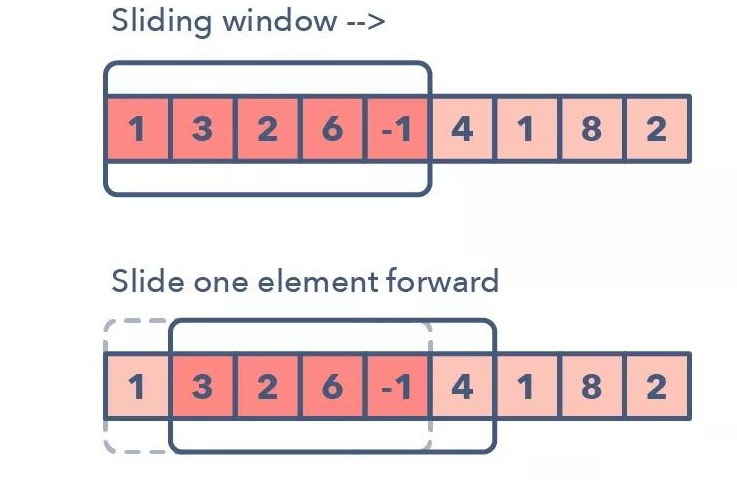

# 滑动窗口

## 1 算法介绍

滑动窗口，顾名思义，就是有一个大小可变的窗口，左右两端方向一致的向前滑动（右端固定，左端滑动；左端固定，右端滑动）。

可以想象成队列，一端在push元素，另一端在pop元素，如下所示：



一般题目中都会有明确的“**连续子数组**”、“**连续子串**”等关键字，另外可能会附带**最大**、**最小**的限定词进行补充。

滑动窗口类型的题目可以分为定长和不定长，即窗口的长度是否是固定的。

---

## 2 不定长滑窗算法模板

1. 在序列中使用双指针中的左右指针技巧，初始化 $l = r = 0$，把索引闭区间 $[l, r]$ 称为一个窗口。
2. 先不断地增加 $r$ 指针扩大窗口 $[l, r]$，直到窗口中的序列符合要求。
3. 此时，停止增加 $r$，转而不断增加 $l$ 指针缩小窗口 $[l, r]$，直到窗口中的序列不再符合要求。同时，每次增加 $l$ 前，都要更新一轮结果。
4. 重复第 2 和第 3 步，直到 $r$ 到达序列的尽头。

思路其实很简单：第 2 步相当于在寻找一个可行解，然后第 3 步在优化这个可行解，最终找到最优解。左右指针轮流前进，窗口大小增增减减，窗口不断向右滑动。

模板如下：

```python
init: l = 0, ans = 最小值 or 最大值
for 右边界 in 可迭代对象:
	更新窗口内部信息
	while 根据题意进行调整：
		比较并更新ans  # 收缩窗口时
		扩张或收缩窗口大小
	比较并更新ans  # 扩张窗口时（可选）
return ans
```

---

## 3 例题

### 3.1 定长滑动窗口


### 3.2 不定长滑动窗口

1. [LCR 008. 长度最小的子数组](/leetcode/8-119经典题变种挑战/挑战%202：数组/LCR%20008.%20长度最小的子数组.md)
2. [3. 无重复字符的最长子串](/leetcode/7-面试经典%20150%20题/3-滑动窗口/3.%20无重复字符的最长子串.md)