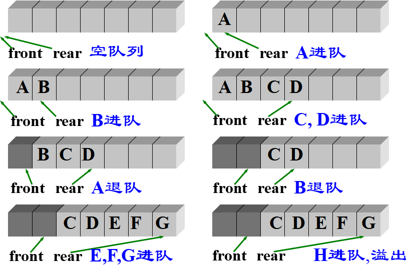
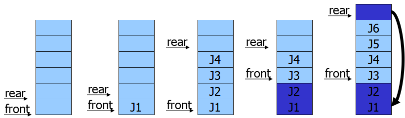
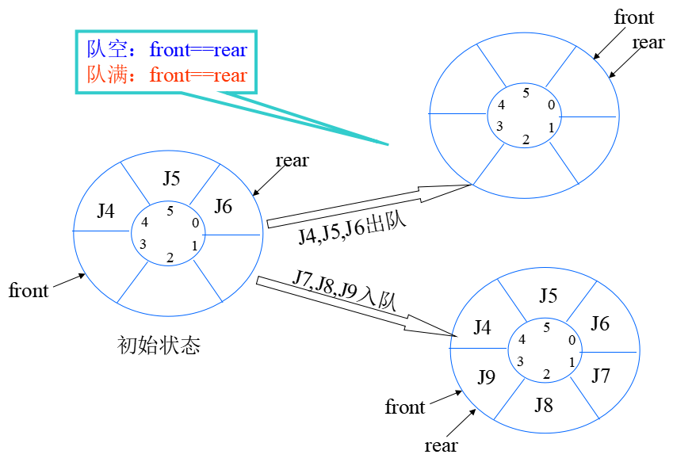
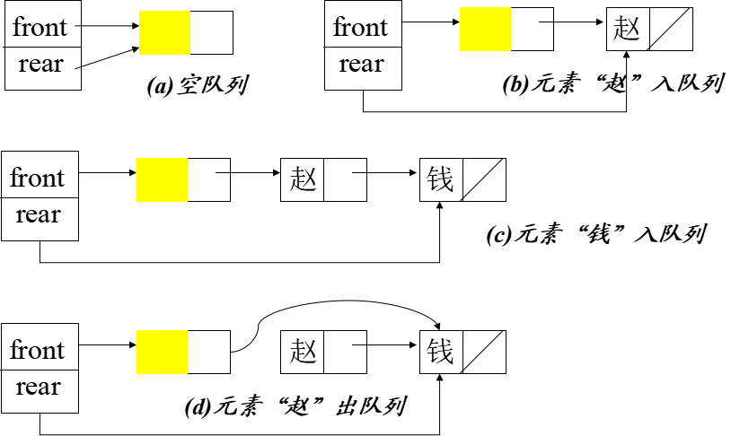

# 1 栈

## 1.1 栈的定义

**栈是只允许在一端进行插入或删除操作的线性表。**

- 只允许在一端插入和删除的顺序表
- 允许插入和删除的一端称为栈顶 (top)
- 另一端称为栈底(bottom)
- 不含元素的空表称空栈
- 特点: 先进后出（FILO）或后进先出（LIFO）


**栈的数学性质：**

n个不同元素进栈，出栈元素不同排列的个数是 $ \frac{1}{n + 1} C_{2n}^{n} $，上述公式被称为**卡特兰（Catalan）数**。

## 1.2 栈的存储结构

### 1.2.1 顺序存储

采用顺序存储的栈称为顺序栈，它利用一组地址连续的存储单元存放自栈底到栈顶的数据元素，同时附设一个指针（top）指示当前栈顶元素的位置。

若现在有一个栈，StackSize是5，则栈的普通情况、空栈、满栈的情况分别如下图所示：


### 1.2.2 共享栈

利用栈底位置相对不变的特征，可让两个顺序栈共享一个一维数组空间，将两个栈的栈底分别设置在共享空间的两端，两个栈顶向共享空间的中间延伸，如下图所示：


两个栈的栈顶指针都指向栈顶元素，$ top_0 = -1 $ 时 0 号栈为空，$ top_1 = MaxSize $ 时 1 号栈为空；

仅当两个栈顶指针相邻 $ top_0 + 1 = top_1 $ 时，判断为栈满。当 0 号栈进栈时 $ top_0 $ 先加 1 再赋值，1 号栈进栈时 $ top_1 $ 先减一再赋值出栈时则刚好相反。 

### 1.2.3 链式存储结构

采用链式存储的栈称为链栈，链栈的优点是便于多个栈共享存储空间和提高其效率，且不存在栈满上溢的情况。通常采用单链表实现，并规定所有操作都是在单链表的表头进行的。

这里规定链栈没有头节点，Lhead指向栈顶元素，如下图所示。


对于空栈来说，链表原定义是头指针指向空，那么链栈的空其实就是 $ top = NULL$ 的时候。

### 1.2.4 性能分析

链栈的进栈push和出栈pop操作都很简单，时间复杂度均为O(1)。

- 对比一下顺序栈与链栈，它们在时间复杂度上是一样的，均为O(1)。
- 对于空间性能：
  - 顺序栈需要事先确定一个固定的长度，可能会存在内存空间浪费的问题，但它的优势是存取时定位很方便。
  - 链栈则要求每个元素都有指针域，这同时也增加了一些内存开销，但对于栈的长度无限制。
- 所以它们的区别和线性表中讨论的一样，如果栈的使用过程中元素变化不可预料，有时很小，有时非常大，那么最好是用链栈。
- 反之，如果它的变化在可控范围内，建议使用顺序栈会更好一些。

## 1.3 栈的应用

### 1.3.1 递归

递归是一种重要的程序设计方法。简单地说，若在一个函数、过程或数据结构的定义中又应用了它自身，则这个函数、过程或数据结构称为是递归定义的，简称递归。

它通常把一个大型的复杂问题层层转化为一个与原问题相似的规模较小的问题来求解。递归策略只需少量的代码就可以描述岀解题过程所需要的多次重复计算。大大减少了程序的代码量但在通常情况下，它的效率并不是太高。

### 1.3.2 括号匹配

### 1.3.3 表达式求值

#### 1.3.3.1 后缀表达式计算结果

表达式求值是程序设计语言编译中一个最基本的问题，它的实现是栈应用的一个典型范例。

- 中缀表达式不仅依赖运算符的优先级，而且还要处理括号。
- 后缀表达式的运算符在操作数后面，在后缀表达式中已考虑了运算符的优先级，没有括号，只有操作数和运算符。

例如中缀表达式 $ A + B ∗ ( C − D ) − E / F $ 所对应的后缀表达式为 $ A B C D − ∗ + E F / $。

> **后缀表达式计算规则**：从左到右遍历表达式的每个数字和符号，遇到是数字就进栈，遇到是符号，就将处于栈顶两个数字出栈，进项运算，运算结果进栈，一直到最终获得结果。

后缀表达式 $ A B C D − ∗ + E F / − $ 求值的过程需要12步，如下表所示：


读者也可将后缀表达式与原运算式对应的表达式树（用来表示算术表达式的二元树）的后序遍历进行比较,可以发现它们有异曲同工之妙。

如下图则是 $ A + B ∗ ( C − D ) − E / F $ 对应的表达式，它的后序遍历（左子树→右子树→根）即是表达式 $ A B C D − ∗ + E F / $。


#### 1.3.3.2 中缀表达式转后缀表达式

把平时所用的标准四则运算表达式，即 $ a + b − a ∗ ( ( c + d ) / e − f ) + g $ 叫做中缀表达式。

因为所有的运算符号都在两数字的中间，现在问题就是中缀到后缀的转化。

> 规则：从左到右遍历中缀表达式的每个数字和符号。若是数字就输出，即成为后缀表达式的一部分；若是符号，则判断其与栈顶符号的优先级，是右括号或优先级低于栈顶符号（乘除优先加减）则栈顶元素依次出栈并输出，并将当前符号进栈，一直到最终输出后缀表达式为止。

例：将中缀表达式 $ a + b − a ∗ ( ( c + d ) / e − f ) + g $ 转化为相应的后缀表达式。

分析：需要根据操作符的优先级来进行栈的变化，我们用icp来表示当前扫描到的运算符ch的优先级，该运算符进栈后的优先级为isp，则运算符的优先级如下表所示[isp是栈内优先（in stack priority）数，icp是栈外优先（in coming priority）数]。


我们在表达式后面加上符号‘#’，表示表达式结束。具体转换过程如下：


即相应的后缀表达式为 $ a b + a c d + e / f − ∗ − g + $。

代码见[表达式求值.cpp](表达式求值.cpp)

---

# 2 队列

## 2.1 队列的基本概念

队列：一种先进先出的线形表。只允许在表一端插入，在另一端删除。

- 队尾rear：插入端，线性表的表尾。
- 队头front：删除端，线性表的表头。


队列的进队和出队：



## 2.2 队列的顺序存储结构

### 2.2.1 队列的顺序存储

顺序存储是指分配一块连续的存储单元存放队列中的元素，并附设两个指针：队头指针和队尾指针。

代码如下：
```C++
#define MaxSize 50
typedef struct
{
	int data[MaxSize];
	int front, rear;
}Queue;
```

如下图所示，此时入队出现“上溢出”，但这种溢出不是真正的溢出，在data数组中依然存在可以存放元素的空位置，所以是一种假溢出。


### 2.2.2 循环队列

将顺序队列臆造成一个环状的空间，即把存储队列元素的表从逻辑上视为一个环，称为**循环队列**。若rear+1==M,则令rear=0;

- 入队：$rear=(rear+1)\%M$; $sq[rear]=x$;
- 出队：$front=(front+1)\%M$; $x = sq[front]$;

为了区分队空还是队满，有三种处理方式：

1. 另外设一个标志以区别队空、队满
2. 类型中增设表示元素个数的数据成员，这样队空的条件为$Q.size = 0$，队满的条件为$Q.front = Q.rear$
3. 牺牲一个单元来区分队空和队满，入队时少用一个队列单元，这是一种较为普遍的做法。
	- 队空：$Q.front = Q.rear$
	- 队满：$(Q.rear + 1) \% M = Q.front$



## 2.3 队列的链式存储结构

### 2.3.1 队列的链式存储

队列的链式表示称为**链队列**，它实际上是一个同时带有队头指针和队尾指针的单链表。头指针指向队头结点，尾指针指向队尾结点，即单链表的最后一个结点。

代码如下：
```C++
// 链队列结点定义
typedef struct
{
	int data;
	struct LinkNode *next;
}LinkNode;
// 链队列定义
typedef struct
{
	LinkNode *front, *rear;
}LinkQueue;
```

- 当$Q.front == null$ 且 $Q.rear == null$时，链队列为空。



不带头节点的链队列在操作上往往比较麻烦，因此通常将链队列设计成一个带头节点的单链表。


---
> 以上内容来自教材以及网上的一些参考资料，在此声明，仅用于个人学习，并无商业用途，并不一一列举参考的文献链接。