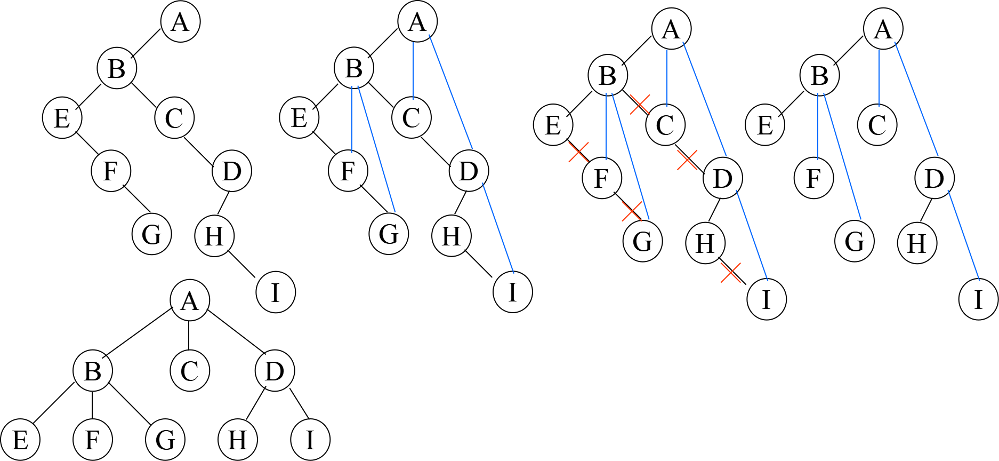
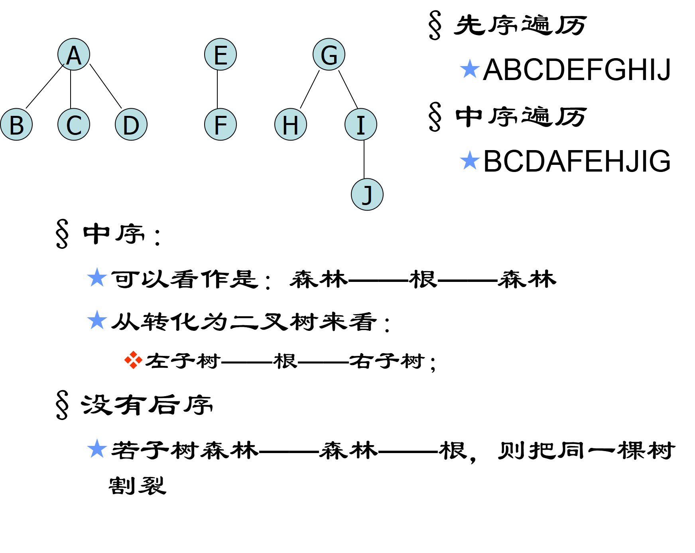

# 1 树的定义和基本概念

树型结构是一类重要的非线性结构。树型结构是结点之间有分支，并且具有层次关系的结构，它非常类似于自然界中的树。树结构在客观世界国是大量存在的，例如家谱、行政组织机构都可用树形象地表示。

树在计算机领域中也有着广泛的应用，例如在编译程序中，用树来表示源程序的语法结构；在数据库系统中，可用树来组织信息；在分析算法的行为时，可用树来描述其执行过程。等等。  

## 1.1 树的定义

定义：树(tree)是n(n>0)个结点的有限集T，其中：有且仅有一个特定的结点，称为树的根(root)。

当n>1时，其余结点可分为m(m>0)个互不相交的有限集T1,T2,……Tm，其中每一个集合本身又是一棵树，称为根的子树(subtree)

特点：

1. 树中至少有一个结点—根
2. 树中各子树是互不相交的集合   


## 1.2 基本概念

- **结点**(node)——指树中的一个数据元素，包括数据项及若干指向其子树的分支。一般用一个字母表示。
- **结点的度**(degree)——结点拥有的子树数
- **叶子**(leaf)——度为0的结点，也叫终端结点。 
- **分支结点**——除叶子结点外的所有结点，也k叫非终端结点。
- **孩子**(child)——结点子树的根称为该结点的孩子
- **双亲**(parents)——孩子结点的上层结点叫该结点的双亲
- **祖先结点**——从根结点到该结点所经过分枝上的所有结点为该结点的祖先。
- **子孙结点**——某一结点的子女及子女的子女都为该结点子孙。
- **兄弟**(sibling)——具有同一个双亲的结点
- **树的度**——一棵树中最大的结点度数
- **结点的层次**(level)——从根结点算起，根为第一层，它的孩子为第二层……
- **深度**(depth)——树中结点的最大层次数
- **有序树**——若一棵树中所有子树从左到右的排序是有顺序的，不能颠倒次序。称该树为有序树。
- **无序树**——若一棵树中所有子树的次序无关紧要，则称为无序树。
- **森林**(forest)——m(m0)棵互不相交的树的集合.一棵树可以看成是一个特殊的森林。


## 1.3 树的其它表示方式


## 1.4 树的性质

树具有如下最基本的性质：

1. 树中的结点数等于所有节点的度数加1。
2. 度为m的树中第 i 层上至多有$ m^{i-1} $ 个结点。
3. 高度为h的m叉树至多有$(m^{h}-1)/(m-1)$个结点。
4. 具有n个结点的m叉树的最小高度为$logm(n(m-1)+1)$向上取整。

---
# 2 二叉树的概念

## 2.1 二叉树的存储结构

### 2.1.1 顺序存储

二叉树的顺序存储结构就是用一维数组存储二叉树中的结点，并且结点的存储位置，也就是数组的下标要能体现结点之间的逻辑关系，比如双亲与孩子之间的关系，左右兄弟之间的关系等。

当然对于一般的二叉树，尽管层序编号不能反映逻辑关系，但是可以将其按完全二叉树编号，只不过，把存在的结点设置为“^”而已。如图中，注意浅色结点表示不存在。


**特点：**
- 结点间关系蕴含在其存储位置中
- 浪费空间，适于存满二叉树和完全二叉树

### 2.1.2 链式存储

二叉树每个结点最多有两个孩子，所以为他设计一个数据域和两个指针域是比较自然的想法，我们称这样的链表叫做二叉链表。


``` C++
// 二叉树的二叉链表结点结构定义
typedef struct BiNode
{
	TElemType data;    				 // 结点数据
	struct BiTNode *lchild,*rchild;  // 左右孩子指针
}
```


另外还有一种三叉链表，定义如下所示。
``` C++
typedef struct Node
{   
	Elemtype data;
	struct Node *lchild, *rchild, *parent;  // parent指针指向父结点
};
```
---
## 2.2 二叉树的遍历

### 2.2.1 二叉树的递归遍历

**遍历**：按一定规律走遍树的各个顶点，且使每一顶点仅被访问一次，即找一个完整而有规律的走法，以得到树中所有结点的一个线性排列。

二叉树的遍历可以分解为：访问根，遍历左子树和遍历右子树。

#### 2.2.1.1 先序遍历

##### 算法思想
根节点→左子树→右子树

``` C++
void pre_order(BiTree T)
{
	if (T != NULL)
	{
		visit(T);
		pre_order(T.lchild);
		pre_order(T.rchild);
	}
}
```
##### 算法图解


#### 2.2.1.2 中序遍历

##### 算法思想
左子树→根节点→右子树

``` C++
void in_order(BiTree T)
{
	if (T != NULL)
	{
		in_order(T.lchild);
		visit(T);
		in_order(T.rchild);
	}
}
```
##### 算法图解


#### 2.2.1.3 后序遍历

##### 算法思想
左子树→右子树→根节点

``` C++
void post_order(BiTree T)
{
	if (T != NULL)
	{
		post_order(T.lchild);
		post_order(T.rchild);
		visit(T);
	}
}
```
##### 算法图解


#### 2.2.1.4 性能分析

- **时间复杂度**：上述三种遍历方式，只是访问根节点的顺序不同，不管采用哪种遍历方法，每个结点都只访问一次，所以时间复杂度均为O(n)
- **空间复杂度**：递归遍历中，栈深刚好是树的深度，所以最坏情况下，空间复杂度为O(n)

### 2.2.2 二叉树的非递归遍历

树的递归过程本质上实对栈的操作过程，因此可以直接通过对栈的读操作，来把递归算法写为非递归算法。

#### 2.2.2.1 先序遍历代码实现
``` C++
int stk[N], tt = -1;
void in_order(BiTree T)
{
	auto p = T;
	while (p || tt)
	{
		if (p)
		{
			visit(p);
			stk[++ tt] = p;
			// 一路走向最左儿子
			p = p.lchild;
		}
		else
		{
			auto t = stk[tt --];
			t = t.rchild;
		}
	}
}
```

#### 2.2.2.2 中序遍历代码实现
``` C++
int stk[N], tt = -1;
void in_order(BiTree T)
{
	auto p = T;
	while (p || tt)
	{
		if (p)
		{
			stk[++ tt] = p;
			// 一路走向最左儿子
			p = p.lchild;
		}
		else
		{
			auto t = stk[tt --];
			visit(t);
			t = t.rchild;
		}
	}
}
```

### 2.2.3 二叉树的层次遍历

**层次遍历**：从上到下、从左到右访问各结点。


进行层次遍历，需要借助一个队列：
- 先将二叉树根节点入队，然后出队，访问出队结点
- 左子树入队
- 右子树入队

#### 2.2.3.1 代码实现

``` C++
int q[N], hh, tt = -1;
void level_order(BiTree T)
{
	q[++ tt] = T;
	while (hh <= tt)
	{
		auto t = q[hh ++];
		visit(t);
		if (t.lchild != NULL) q[++ tt] = t.lchild;
		if (t.rchild != NULL) q[++ tt] = t.rchild;
	}
}
```

## 2.3 线索二叉树

### 2.3.1 基础概念

传统的二叉树中仅能体现一种父子关系，不能得到结点在遍历中的前驱或后继。在有n个结点的二叉链表中必定有n+1个空链域，能否利用这些空指针域来存储其前驱或后继的指针？

**线索**：指向前驱或后继结点的指针
**线索二叉树**：加上线索的二叉链表表示的二叉树，可以加快查找结点前驱和后继的速度
**线索化**：对二叉树按某种遍历次序使其变为线索二叉树的过程

**二叉树的二叉线索存储表示**
``` C++
// Link==0:指针,Thread==1:线索
typedef enum {Link, Thread} PointerTag;  

typedef struct BiThrNode
{
    TElemType data;
    struct BiThtNode *lchild, *rchild;                            
    PointerTag LTag, Rtag;
}BiTreeNode, *BiThrTree;  
```

### 2.3.2 中序线索二叉树的构造

对普通二叉树以某种次序遍历使其成为线索二叉树的过程就叫做线索化。因为前驱和后继结点只有在二叉树的遍历过程中才能得到，所以线索化的具体过程就是在二叉树的遍历中修改空指针。

线索二叉树分为前序线索二叉树、中序线索二叉树和后续线索二叉树。

#### 2.3.2.1 算法思想

1. 指针 p 指向根节点，pre 初始化为空，pre 永远指向 p 的前驱。
2. 若 p 非空，则冲入一下操作：
   - 中序遍历线索化 p 的左子树。（递归）
   - 若 p 的左子树为空，则给 p 加上左线索，即 p.ltag = true，p 的左子树指针指向 pre(前驱)，即 p.lchild = pre；否则令 p.ltag = false。
   - 若 pre非空，则判断如果 pre 的右子树为空，给 pre 加上右线索，即 pre.rtag = true，pre 的右孩子指针指向 p (后继)，即 pre.rchild = p；否则令 pre.rtag = false。
   - p 赋值给 pre，p 转向 p 的右子树。
   - 中序遍历线索化 p 的右子树。（递归）
3. 处理最后一个节点，令其后继为空，即 pre.rchild = NULL；pre.rtag = true。

#### 2.3.2.2 算法过程


#### 2.3.2.3 代码实现
``` C++
void in_thread(ThreadTree& p, ThreadTree& pre)
{
	if (p) 
	{
		// 递归 线索化左子树
		in_thread(p->lchild);
		if (p->lchild == NULL) 
		{
			// 建立前驱线索
		    p->ltag = true;
		    p->lchild = pre;
		} 
		else p->ltag = false;

		if (pre != NULL && pre->rchild == NULL) 
		{
			// 建立前驱结点的后继线索
			pre->rtag = true;
			pre->rchild = p;
		}
		// 标记当前结点为刚刚访问过的结点
		pre = p;
		// 递归 线索化右子树
		InThread(p->rchild);
	}
}

void CreateInThread(Btree &T) {
    pre = nullptr;
	// 非空二叉树 线索化
    if (T) 
	{
        InThread(T, pre);
		// 处理遍历的最后一个结点
        pre->rtag = true;
        pre->rchild = nullptr;
    }
}
```
---
# 3 树、森林

## 3.1 树的存储结构

### 3.1.1 双亲表示法

定义结构数组存放树的结点，每个结点含两个域：

- 数据域：存放结点本身信息
- 双亲域：指示本结点的双亲结点在数组中位置

**特点：**
- 对于实现求双亲操作很方便，时间复杂度为O(1)
- 对于求某结点的孩子结点的操作，则需要询整个数组
- 这种存储方式不能直接反映各兄弟结点之间的关系，所以实现求兄弟的操作也比较困难


### 3.1.2 孩子表示法

把每个结点的孩子结点排列起来， 以单链表作存储结构，则 n 个结点有 n 个孩子链表，如果是叶子结点则此单链表为空。然后 n 个头指针又组成一个线性表，采用顺序存储结构，存放进一个一维数组中，如图所示：


### 3.1.3 孩子兄弟表示法

对于树这样的层级结构来说，只研究结点的孩子是不行的，我们观察后发现，任意一棵树， 它的结点的第一个孩子如果存在就是唯一的，它的右兄弟如果存在也是唯一的。 因此，我们设置两个指针，分别指向该结点的第一个孩子和此结点的右兄弟。


其中 data 是数据域，firstchild 为指针域，存储该结点的第一个孩子结点的存储地址，rightsib 是指针域，存储该结点的右兄弟结点的存储地址。


``` C++
typedef struct CSNode
{
	ElemType data;
	struct CSNode *firstChild，*nextSibling;
}CSNode, *CSTree;
```
**特点：**

- 存储方式比较灵活，可以方便地实现树转换为二叉树的操作，易于查找结点的孩子和兄弟等
- 从当前结点查找其双亲结点比较麻烦

## 3.2 树、森林与二叉树的转换

由于二叉树和树都可以用二叉链表作为存储结构，因此以二叉链表作为媒介可以导出树与二叉树的一个对应关系，即给定一棵树，可以找到唯一的一棵二叉树与之对应。

从物理结构上看，它们的二叉链表是相同的，只是解释不同而已。


### 3.2.1 树转换成二叉树

将树转换为二叉树的画法：

1. 加线：在兄弟之间加一连线
2. 抹线：对每个结点，除了其左孩子外，去除其与其余孩子之间的关系旋转：
3. 以树的根结点为轴心，将整树顺时针转45°


### 3.2.2 二叉树转换为树

将二叉树转换为树的画法：

1. 加线：若p结点是双亲结点的左孩子，则将p的右孩子，右孩子的右孩子，……沿分支找到的所有右孩子，都与p的双亲用线连起来抹线：
2. 抹掉原二叉树中双亲与右孩子之间的连线调整：将结点按层次排列，形成树结构



### 3.2.3 森林转换成二叉树

将森林转换为二叉树的画法：

1. 将各棵树分别转换成二叉树
2. 将每棵树的根结点用线相连以第一棵树根结点为二叉树的根
3. 以根结点为轴心，顺时针旋转，构成二叉树型结构


### 3.2.4 二叉树转换成森林

将二叉树转换为森林的画法：

1. 抹线：将二叉树中根结点与其右孩子连线，及沿右分支搜索到的所有右孩子间连线全部抹掉，使之变成孤立的二叉树还原
2. 将孤立的二叉树还原成树


## 3.3 树的遍历

树的遍历是指按一定规律走遍树的各个顶点，且使每一顶点仅被访问一次，即找一个完整而有规律的走法，以得到树中所有结点的一个线性排列。

主要有3种方式：

1. 先根（序）遍历：先访问树的根结点，然后依次先根遍历根的每棵子树
2. 后根（序）遍历：先依次后根遍历每棵子树，然后访问根结点
3. 按层次遍历：先访问第一层上的结点，然后依次遍历第二层，……第n层的结点


## 3.4 森林的遍历

按照森林和树相互递归的定义，可得到森林的两种遍历方法。

1. 先序遍历森林：
   - 访问森林中第一棵树的根结点；
   - 先序遍历第一棵树根结点的子树森林；
   - 先序遍历除第一棵树后剩余的树构成的森林；
2. 中序遍历森林：
   - 中序遍历第一棵树根结点的子树森林；
   - 访问第一棵树的根结点；
   - 中序遍历除第一棵树后剩余的树构成的森林；



---
# 4 树与二叉树的应用

## 4.1 二叉排序树BST

### 4.1.1 二叉排序树的定义

**二叉排序树(Binary Sort Tree)**，又称**二叉查找树**。它是一颗**空树**，或者具有下列性质：

- 若它的左子树不为空，则**左子树上所有结点的值均小于它的根结点的值**；
- 若它的右子树不为空，则**右子树上所有结点的值均大于它的根结点的值**；
- **它的左、右子树分别为二叉排序树**


根据二叉排序树的定义，左子树结点值 < 根结点值 < 右子树结点值，所以对二叉排序树进行中序遍历，可以得到一个递增的有序序列。

### 4.1.2 二叉排序树的查找

- 二叉排序树的查找可以用递归来实现；
- 先将要查找的关键字和根节点进行比较;
- 若和根节点值相同，则返回根节点值；**若比根节点小，就递归查找左子树，若比根节点大，则递归查找右子树**。

#### 4.1.2.1 递归代码实现

```C++
bool bst_search(BiTree t, int key)
{
    if (!t) return false;
    if (t.data == key) return true;
    
    if (t.data < key) return bst_search(t->left, key);
    else return bst_search(t->right, key);
}
```

#### 4.1.2.2 非递归代码实现

```C++
bool bst_search(BiTree t, int key)
{
    while (t && key != t.data)
    {
        if (key < t.data) t = t->left;
        else t = t->right;
    }
    return key == t.data;
}
```

### 4.1.3 二叉排序树的插入

先调用**查找操作**将要插入的关键字进行比较，如果在原有的二叉排序树中没有要插入的关键字，则将关键字与查找的结点p（在查找操作中返回的结点）的值进行比较。


- **若p为空，则插入关键字赋值给该节点；**

- **若小于结点p的值，则插入关键字作为结点p的左子树；**
- **若大于结点p的值，则插入关键字作为结点p的右子树；**

```C++
/**
 * 二叉排序树的插入
 * 当二叉排序树中不存在关键字等于 key 的数据元素时，插入 key 并返回TRUE
 */
int InsertBST(BiTree * T, int key)
{
    BiTree p,s;
    if (!SearchBST( *T, key, NULL, &p)) {  // 没找到key
        s = (BiTree)malloc(sizeof(BiTNode));
        s->data = key;
        s->lchild = s->rchild = NULL;
        
        if (!p)
            *T = s;  // 插入 s 为新的根结点
        else if (key < p->data)
            p->lchild = s;  //插入 s 为左孩子
        else
            p->rchild = s; // 插入 s 为右孩子
        
        return TRUE;
    }else
        return FALSE;
}
```

### 4.1.4 二叉排序树的删除

二叉排序树的删除操作相对复杂，因为不能因为删除了结点，让这颗二叉排序树变得不满足二叉排序树的性质，所以对于二叉排序树的删除存在三种情况：

- **叶子结点**；（很容易实现删除操作，**直接删除结点即可**）
- **仅有左或者右子树的结点**；（容易实现删除操作，**删除结点后，将它的左子树或者右子树整个移动到删除结点的位置**）


- **左右子树都有的结点**，就以右子树内的最小节点取代A。（实现删除操作很复杂）


```C++
void DeleteBSTNode(BST_P *root, DataType data)
{
    BST_P p = *root, parent = NULL, s = NULL;

    if (!p) return;

    if (p->data == data) //找到要删除的节点了
    {
        /* It's a leaf node */
        if (!p->rchild && !p->lchild) 
            *root = NULL;

        // 只有一个左节点
        else if (!p->rchild&&p->lchild) 
            *root = p->lchild;

        // 只有一个右节点
        else if (!p->lchild&&p->rchild) 
            *root = p->rchild;

        //左右节点都不空
        else 
        {
            s = p->rchild;
            /* the s without left child */
            if (!s->lchild)
                s->lchild = p->lchild;
            /* the s have left child */
            else 
            {
                /* find the smallest node in the left subtree of s */
                while (s->lchild) 
                {
                    /* record the parent node of s */
                    parent = s;
                    s = s->lchild;
                }
                parent->lchild = s->rchild;
                s->lchild = p->lchild;
                s->rchild = p->rchild;
            }
            *root = s;
        }
        free(p);
    }
    else if (data > p->data) //向右找
        DeleteBSTNode(&(p->rchild), data);
    else if (data < p->data) //向左找
        DeleteBSTNode(&(p->lchild), data);
}
```

### 4.1.5 查找效率分析

二叉排序树的查找效率主要取决于树的高度。

- 若二叉排序树的左、右子树的高度之差的绝对值不超过1，则这样的二叉排序树称为**平衡二叉树**，它的平均查找长度是O(logn)。

- 若二叉排序树是一个只有右（左）孩子的单支树，则其平均查找长度为O(n)。

在最坏情况下，构造二叉排序树的输入序列是有序的，则会形成一个倾斜的单支树，此时二叉排序树的性能显著变坏，树的高度也增加为元素个数n，如下图所示。


此时查找性能显著下降。从查找过程来看，二叉排序树与二分查找类似。

- 平均时间性能：二叉排序树的查找与二分查找差不多，但是二分查找的判定树唯一，而二叉排序树的查找不唯一，相同的关键字其插入顺序不同可能生成不同的二叉排序树。
- 维护表的有序性：二叉排序树无须移动结点，只需修改指针即可完成插入和删除操作，平均执行时间为o(logn)。二分查找的对象是有序顺序表，若有插入和删除结点的操作，所花的代价是O(n)。

当有序表是静态查找表时，宜用顺序表作为其存储结构，采用二分查找实现其查找操作。

若为动态查找表，应选择二叉排序树作为其逻辑结构。

## 4.2 平衡二叉树

### 4.2.1 平衡二叉树的定义

为了避免树的高度增长过快，降低二叉排序树的性能，规定在插入和删除二叉树结点时，要保证任意节点的左、右子树高度差的绝对值不超过1。

平衡二叉树也叫AVL树，它或者是一颗空树，或者具有以下性质的二叉排序树：

1. 它的左子树和左子树的高度之差(平衡因子)的绝对值不超过1
2. 它的左子树和右子树都是一颗平衡二叉树

平衡的二叉树：


不平衡的二叉树：


### 4.2.2 平衡二叉树的插入

假设现在有一颗平衡二叉树T，每当插入一个节点时，检查平衡二叉树T是否还是平衡二叉树，只需要调整最小不平衡子树中各节点之间的连接关系，以达到新的平衡。

即找出节点左右两个子树的深度差的绝对值等于2的结点，调整即可，保证插入一个节点后，还是满足平衡二叉树T。


过程分为以下几个步骤：

1. T是一颗平衡二叉树
2. 新增一个结点，并判断有结点平衡因子是否=2
3. 若存在结点平衡因子=2，找出结点平衡因子=2的结点，并以此结点作为子树
4. 调整结点，使子树满足平衡二叉树

#### 4.2.2.1 LL型（单向右旋）

LL型，结点B右旋即可，使其变成如下情况：

- B为子树的根结点
- A为B的右孩子
- C为B的左孩子


#### 4.2.2.2 RR型（单向左旋）

RR型，结点B右旋即可，使其变成如下情况：

- B为子树的根结点
- A为B的左孩子
- C为B的右孩子


#### 4.2.2.3 LR型（先左后右双旋转）

LR型，需要操作两个步骤：

1. 以B结点为子树，单向左旋；
2. 以A结点为子树，单向右旋。

使其变成如下情况：

- C为子树的根结点
- B为C的左孩子
- A为C的右孩子


#### 4.2.2.4 RL型（先右后左双旋转）

过程与LR型相反。


### 4.2.3 平衡二叉树的查找

查找过程与二叉排序树基本相同，假设以Nh表示深度为h的平衡树中含有的最少结点数，显然，有N0=0，N1=1，N2=2，并且Nh=Nh-1+Nh-2+1。平衡二叉树的平均查找长度为O(logn)。

## 4.3 哈夫曼树和哈夫曼编码

### 4.3.1 哈夫曼树

哈夫曼树（Huffman）：带权路径长度最短的树，树中所有叶结点的带权路径长度之和称为该树的带权路径长度，记为：
$$
w p l=\sum_{k=1} w_{k} l_{k}
$$
其中，wk是第k个叶结点所带的权值，lk是该叶结点到根节点的路径长度。

在含有n个带权叶结点的二叉树中，其中带权路径长度（WPL）最小的二叉树称为哈夫曼树，也称最优二叉树。

> 例：有4个结点，权值分别为7，5，2，4，构造有4个叶子结点的二叉树。


### 4.3.2 哈夫曼树的构造

根据给定的n个权值{w1,w2,……wn}，构造n棵只有根结点的二叉树，令其权值为wj。

1. 将这n个结点分别作为n棵仅含一个结点的二叉树，构成森林F。
2. 在森林中选取两棵根结点权值最小的树作左右子树，构造一棵新的二叉树，置新二叉树根结点权值为其左右子树根结点权值之和。
3. 在森林中删除这两棵树，同时将新得到的二叉树加入森林中。
4. 重复上述两步，直到只含一棵树为止，这棵树即哈夫曼树。

**哈夫曼树的特点**：

1. 每个初始结点最终都将称为叶结点，且权值越小的结点到根节点的路径长度越大。
2. 构造过程中共新建了n-1个结点，因此哈夫曼树的结点总数为2n-1。
3. 每次构造都选择2棵树作为新结点的孩子，因此不存在度为1的结点。


### 4.3.3 哈夫曼编码

数据通信用的二进制编码，思想是根据字符出现频率编码，使电文总长最短

**编码**：根据字符出现频率构造Huffman树，然后将树中结点引向其左孩子的分支标“0”，引向其右孩子的分支标“1”；每个字符的编码即为从根到每个叶子的路径上得到的0、1序列。

**前缀编码**：没有一个编码是另一个编码的前缀。

> 例：要传输的字符集 D={C,A,S,T, ; }，字符出现频率 w={2,4,2,3,3}。


译码：从Huffman树根开始，从待译码电文中逐位取码。若编码是“0”，则向左走；若编码是“1”，则向右走，一旦到达叶子结点，则译出一个字符；再重新从根出发，直到电文结束

例如，电文是{CAS;CAT;SAT;AT}，其编码：“11010111011101000011111000011000”，电文为“1101000”，译文只能是“CAT”。

0和1究竟是表示左子树还是右子树没有明确规定，左、右孩子结点的顺序是任意的，所以构造出的哈夫曼树并不唯一，但各哈夫曼树的带权路径长度WPL相同且为最优。

此外，如果有若干权值相同的结点，则构造出的哈夫曼树更可能不同，但WPL必然相同且是最优的。

---
# 5 红黑树

实平衡二叉树最大的作用就是查找,AVL树的查找、插入和删除在平均和最坏情况下都是O(logn)。AVL树的效率就是高在这个地方。如果在AVL树中插入或删除节点后，使得高度之差大于1。此时，AVL树的平衡状态就被破坏，它就不再是一棵二叉树；

为了让它重新维持在一个平衡状态，就需要对其进行旋转处理, 那么创建一颗平衡二叉树的成本其实不小。

有人提出了红黑树的理论，红黑树在业界应用很广泛，比如 Java 中的 TreeMap，JDK 1.8 中的 HashMap、C++ STL 中的 map 均是基于红黑树结构实现的。

## 5.1 红黑树简介

红黑树是一种自平衡的二叉查找树，是一种高效的查找树。它是由 Rudolf Bayer 于1978年发明，在当时被称为平衡二叉 B 树(symmetric binary B-trees)。后来，在1978年被 Leo J. Guibas 和 Robert Sedgewick 修改为如今的红黑树。红黑树具有良好的效率，它可在 O(logN) 时间内完成查找、增加、删除等操作。

### 5.1.1 为什么需要红黑树

对于二叉搜索树，如果插入的数据是随机的，那么它就是接近平衡的二叉树，平衡的二叉树，它的操作效率（查询，插入，删除）效率较高，时间复杂度是O（logN）。

但是可能会出现一种极端的情况，那就是插入的数据是有序的（递增或者递减），那么所有的节点都会在根节点的右侧或左侧，此时，二叉搜索树就变为了一个链表，它的操作效率就降低了，时间复杂度为O(N)，所以可以认为二叉搜索树的时间复杂度介于O（logN）和O(N)之间，视情况而定。那么为了应对这种极端情况，红黑树就出现了，它是具备了某些特性的二叉搜索树，能解决非平衡树问题，红黑树是一种接近平衡的二叉树（说它是接近平衡因为它并没有像AVL树的平衡因子的概念，它只是靠着满足红黑节点的5条性质来维持一种接近平衡的结构，进而提升整体的性能，并没有严格的卡定某个平衡因子来维持绝对平衡）。

### 5.1.2 红黑树的特性

首先，红黑树是一个二叉搜索树，它在每个节点增加了一个存储位记录节点的颜色，可以是RED，也可以是BLACK；

通过任意一条从根到叶子简单路径上颜色的约束，红黑树保证最长路径不超过最短路径的二倍，因而近似平衡（最短路径就是全黑节点，最长路径就是一个红节点一个黑节点，当从根节点到叶子节点的路径上黑色节点相同时，最长路径刚好是最短路径的两倍）。它同时满足以下特性：

1. 节点是红色或黑色
2. 根是黑色
3. 叶子节点（外部节点，空节点）都是黑色，这里的叶子节点指的是最底层的空节点（外部节点），下图中的那些null节点才是叶子节点，null节点的父节点在红黑树里不将其看作叶子节点
4. 红色节点的子节点都是黑色
   - 红色节点的父节点都是黑色
   - 从根节点到叶子节点的所有路径上不能有 2 个连续的红色节点

4. 从任一节点到叶子节点的所有路径都包含相同数目的黑色节点
