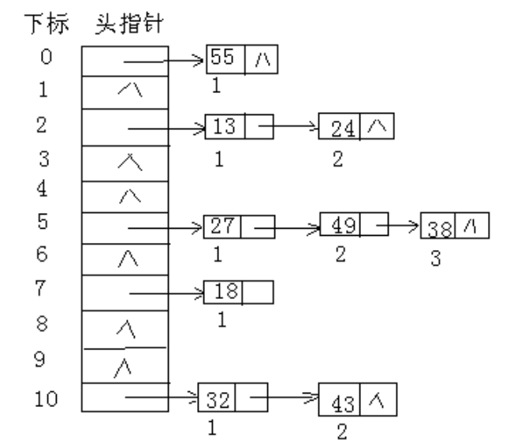
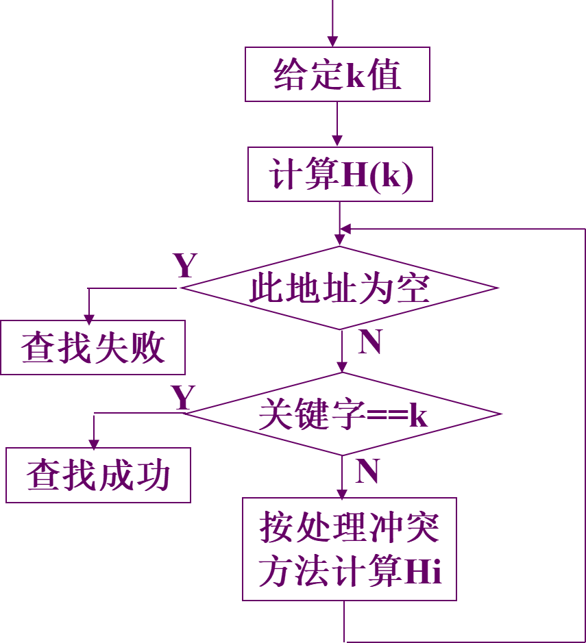

# 1 总览

**查找表**：查找表是由同一类型的数据元素（或记录）构成的集合。由于“集合”中的数据元素之间存在着完全松散的关系，因此查找表是一种非常灵便的数据结构，可以用其他的数据结构来实现。

**动态查找表**：若在查找的同时对表做修改操作（插入删除等）则相应的表称之为动态查找表；否则称之为静态查找表。

**平均查找长度ASL**（查找算法的评价指标）：为确定记录在查找表中的位置，需和给定值进行比较的关键字个数的期望值，称为查找算法在查找成功时的平均查找长度（Average Search Length）。

**对查找表常进行的3种操作：**
1. 查询某个特定的值是否在表中
2. 插入一个元素
3. 删除一个元素
---
# 2 顺序查找和折半查找

## 2.1 顺序查找

**算法思想**

通过数组下标递增来顺序操作每个元素，返回结果。

**优点**：对数据存储结构没有任何要求。

**缺点**：平均查找长度ASL=n，效率较低。

## 2.2 折半查找

折半查找是一种效率高效的查找方法，但是仅适用于有序的顺序表。

折半查找算法思路：（非递归）

1. 设表长为n、low、high和mid分别指向待查元素所在区间的上界、下界和中点，key为给定的要查找的值。
2. 初始时，令low=1，high=n，mid=[(low+high)/2]。
3. 让k与mid指向的记录比较；若key==R[mid].key，查找成功；若key<R[mid].key，则high=mid-1;若key>R[mid].key，则low=mid+1；若low>high,则返回0代表元素不存在。

```C++
bool check(int mid)
{
	// todo
}

// 将区间[l, r]划分成[l, mid]和[mid + 1, r]，mid不需要加1
int binary_search_1(int l, int r)
{
    while (l < r)
    {
        int mid = l + r >> 1;
        if (check(mid)) r = mid;
        else l = mid + 1;
    }
    return l;
}

// 将区间[l, r]划分成[l, mid - 1]和[mid, r]，mid需要加1
int binary_search_2(int l, int r)
{
    while (l < r)
    {
        int mid = l + r + 1 >> 1;
        if (check(mid)) l = mid;
        else r = mid - 1;
    }
    return l;
}
```

折半查找的过程可以用判定树来表示，把顺序表中的每个元素查找到所用的查找次数写出来，然后次数为1的作为树的根结点，然后查找次数为2的放到第二层，依次把每个元素放到树中。

查找成功时的查找长度为从根结点到目的结点的路径上的结点数，而查找失败为从根结点到对应失败结点的父结点的路径上的结点数。每个结点的值均大于其左子结点，均小于其右子结点。


折半查找的时间复杂度为O(logn)，要求线性表必须具有随机存取的特性，仅适用于顺序存储结构，不适于链式存储结构。

## 2.3 分块查找

分块查找是一种性能介于顺序查找和折半查找之间的一种查找方法。

**算法思想**

1. 将表分成几块，且表或者有序，或者分块有序；即若i < j，则第j块中所有记录的关键字均大于第i块中的最大关键字。（注意在块内元素可以是无序的）。
2. 建立索引表（每个结点含有最大关键字域和指向本块第一个结点的指针，且按关键字有序）。

**查找过程**：首先确定待查记录所在块（顺序或折半查找），再在块内查找（顺序查找）。


## 2.4 上述三种查找对比


---

# 3 B树

B树，又称**多路平衡查找树**，B树中所有结点的孩子个数的最大值成为B树的**阶**，通常用m表示。

在大多数的平衡查找树（Self-balancing search trees），比如 AVL 树和红黑树，都假设所有的数据放在主存当中。那为什么要使用 B-树呢（或者说为啥要有 B-树呢）？要解释清楚这一点，我们假设我们的数据量达到了亿级别，主存当中根本存储不下，我们只能以块的形式从磁盘读取数据，与主存的访问时间相比，磁盘的 I/O 操作相当耗时，而提出 B-树的主要目的就是**减少磁盘的 I/O 操作**。

大多数平衡树的操作（查找、插入、删除，最大值、最小值等等）需要O(h)次磁盘访问操作，其中 h 是树的高度。但是对于 B-树而言，树的高度将不再是 O(logn) （其中 n 是树中的结点个数），而是一个我们可控的高度 h（通过调整 B-树中结点所包含的键【你也可以叫做数据库中的索引，本质上就是在磁盘上的一个位置信息】的数目，使得 B-树的高度保持一个较小的值）。

一般而言，B-树的结点所包含的键的数目和磁盘块大小一样，从数个到数千个不等。由于B-树的高度 h 可控（一般远小于 logn），所以与 AVL 树和红黑树相比，B-树的磁盘访问时间将极大地降低。

## 3.1 B树的特性

1. 所有的叶子结点都出现在同一层上，并且不带信息(可以看做是外部结点或查找失败的结点，实际上这些结点不存在，指向这些结点的指针为空)。
2. 每个结点包含的关键字个数有上界和下界。用一个被称为 B-树的**最小度数**的固定整数 t ≥ 2 来表示这些界，其中 t 取决于磁盘块的大小：
   1. 除根结点以外的每个结点必须至少有 t - 1 个关键字。因此，除了根结点以外的每个内部结点有 t 个孩子。如果树非空，根结点至少有一个关键字。
   2. 每个结点至多包含 2t - 1 个关键字。
3. 一个包含 x 个关键字的结点有 x + 1 个孩子；
4. 一个结点中的所有关键字升序排列，两个关键字 k~1~ 和 k~2~ 之间的孩子结点的所有关键字 key 在 (k~1~, k~2~) 的范围之内。
5. 与二叉排序树不同， B-树的搜索是从根结点开始，根据结点的孩子树做多路分支选择，而二叉排序树做的是二路分支选择，每一次判断都会进行一次磁盘 I/O 操作。
6. 与其他平很二叉树类似，B-树查找、插入和删除操作的时间复杂度为 O(logn) 量级。


## 3.2 B树的查找

B树的查找包含两个基本操作：

1. 在B树中找结点
2. 在结点内找关键字

B树常存储在磁盘上，第一个操作是在磁盘上进行的，后一个查找操作是在内存中进行的。在结点内通常采用顺序查找或折半查找。

（1）将给定值与根结点关键字相比较，如果相等，那么查找成功。
（2）如果，小于Ki，那么下次从以 Ai-1 为根的子树中查找。否则下次从以 Ai+1 为根的子树中查找。
（3）如果，查找到叶子结点，那么查找失败。


例如，在4阶B-树中查找给定值26，首先与根结点上的关键字35比较。因为26<35，所以，由A0找到结点B。因为26>18，再与结点E上的关键字比较，26<27，而该结点的A0子树为失误结点叶子。所以，确定该树中不存在26，查找失败。

## 3.3 B树的插入

在B树中找到插入的位置后，并不能简单地将其添加到终端结点，因为此时可能会导致整棵树不符合B树定义中的要求，插入过程如下：

1. 从根结点开始按照查找的过程确定给定值应插入的结点位置P。
2. 如果，该结点上的关键字个数少于 m - 1 个，则将给定值直接插到该结点上。
3. 如果应插入的结点上，已有 m - 1 个关键字，那么，必须把该结点分裂成两个结点；（P、P’） 。

**分裂的方法是：**

- 取一个新的结点，在插入key后的原结点，从中间位置 m / 2（向上取整）将其中的关键字分为两部分，左部分包含的关键字放在原结点，右部分的关键字放在新结点中，中间位置 m / 2（向上取整）的结点插入原结点的父节点。

- 如果此时导致父结点的关键字个数也超过了上限，继续进行这种分裂，直到传递到根节点位置。

**举例如下：**


## 3.4 B树的删除

B树的删除操作与插入类似，但是复杂一些，因为可能涉及结点的合并。

---
# 4 B+树

B+树是应数据库所需出现的一种B树的变形树。

一棵m阶的B+树和m阶的B-树的差异在于:

1. 有n棵子树的结点中含有n个关键字。
2. 所有的叶子结点中包含了全部关键字的信息，以及指向含这些关键字记录的指针，且叶子结点本身依关键字的大小自小而大顺序链接。
3. 所有的非终端结点可以看成是索引部分，结点中仅含有其子树(根结点）中的最大（或最小）关键字。


可以看出，分支结点的某个关键字是其子树中最大关键字的副本。通常在B+树中有两个头指针：一个指向根节点，另一个指向关键字最小的叶结点。

因此，可以对B+树进行两种查找运算：
1. 从最小关键字开始的顺序查找
2. 从根节点开始的多路查找

为什么数据库不适用哈希索引？
- 因为数据库查找中通常有很多范围查找，但是哈希值是无序的，所以不能使用。

---
# 5 散列表

前面讨论的线性表、树表结构的查找方法，这类查找方法都是以关键字的比较为基础的。而散列表的思想是通过对元素的关键字值进行某种运算，直接求出元素的地址，即使用关键字到地址的直接转换方法，而不需要反复比较。

散列函数和散列地址：在记录的存储位置p和其关键字key之间建立一个确定的对应的关系H，使p=H(key)，称这个对应关系H为散列函数，p为散列地址。

散列方法（杂凑法）：选取某个函数，依该函数按关键字计算元素的存储位置，并按此存放；查找时，由同一个函数对给定值k计算地址，将k与地址单元中元素关键码进行比对，确定查找是否成功。

散列表：一个有限连续的地址空间，用以存储按散列函数计算得到相应散列地址的数据记录。通常散列表的存储空间是一个一维数组，散列地址是数组的下标。

冲突和同义词：对不同的关键字可能得到同一散列地址，即key1!=key2，而H(key1) = H(key2)，这种现象称为冲突。具有相同函数值的关键对该散列函数来说称作同义词，key1与key2互称为同义词(冲突是不可避免的，我们只能尽可能减少)。

## 5.1 散列函数的构造方法

在构造散列函数时，必须注意以下几点：

1. 构造好的散列函数，所选函数尽可能简单，以便提高转换速度。
2. 所选函数对关键码计算出的地址，应在散列地址集中致均匀分布，以减少空间浪费。
3. 制定一个好的解决冲突的方案，查找时如果从散列函数计算出的地址查不到关键码，则应当依据解决冲突的规则，有规律的查询其它相关单元。

### 5.1.1 直接定址法
直接取关键字的某个线性函数值为散列地址，散列函数为H(key) = a × key + b。


这类函数计算简单，分布均匀，不会产生冲突，但要求地址集合与关键词集合大小相同，因此，对于较大的关键词集合不适用。所以在现实应用中并不常用。

### 5.1.2 除留余数法
现实应用中比较常用的方法是除留取余法。假设散列表长为TableSize（TableSize的选取，通常由关键词集合的大小n和允许最大装填因子α决定，一般将TableSize取为 n / α ）,选择一个正整数p<=TableSize，散列函数为：

$$
h(key) = key \% p
$$

即取关键词除以p的余数作为散列地址。使用除留取余法，选取合适的p很重要，一般选取p为小于或等于散列表长TableSize的某个最大素数比较好。

用素数求得的余数作为散列地址，比较均匀分布在整个地址空间上的可能性较大。


### 5.1.3 数字分析法
设关键字是 r 进制数（如十进制数），而 r 个数码在各位上出现的频率不一定相同，此时应选取数码分布较均匀的若干位作为散列地址。


这种方法适用于已知的关键字集合，若更换了关键字，则需要重新构造新的散列函数。

### 5.1.4 平方取中法

构造：取关键字平方后中间几位作哈希地址

适用范围：关键字的每位取值都不够均匀或均小于散列地址所需的位数。

在不同的情况下，不同的散列函数具有不同的性能，因此不能笼统地说哪种散列函数最好。在实际选择中，采用何种构造散列函数的方法取决于关键字集合的情况，但目标是尽量降低产生冲突的可能性。

## 5.2 处理冲突的方法

### 5.2.1 开放定址法


当冲突发生时，形成一个探查序列；沿此序列逐个地址探查，直到找到一个空位置（开放的地址），将发生冲突的记录放到该地址中，即：

$$
H i=(H(k e y)+d i) M O D ~ m, \quad i=1,2, \cdots \cdots \cdot k(k \leq m-1)
$$

其中：H(key)是哈希函数，m是哈希表表长，di是增量序列。

取定某一增量序列后，对应的处理方法就是确定的，通常有以下4中取法。

#### 5.2.1.1 线性探测法

$$
f_{i}(k e y)=\left(f(k e y)+d_{i}\right) M O D m\left(d_{i}=1,2,3, \cdots, m-1\right)
$$

使用该公式**用于解决冲突的开放定址法**称为**线性探测法**。

对于**线性探测法**，在出现冲突时，它只能**晚后一步一步检测**看**是否有空位置**，假设此时该冲突位置**后**续**没有可用位置**，但前面**有一个空位置**。**尽管**可以不断地求余数后得到结果，但效率很差。

#### 5.2.1.2 二次探测法

因此可以改进该算法，增加双向寻找可能的**空位置**，这种新算法称为**二次探测法**：

$$
f_{i}(k e y)=\left(f(k e y)+d_{i}\right) M O D m\left(d_{i}=1^{2},-1^{2}, 2^{2},-2^{2}, \cdots, q^{2},-q^{2}, q \leq m / 2\right)
$$

散列表长度m必须是一个可以表示成4k+3的素数，才能保证探测到所有位置。

> 为什么？

缺点是不能探测到散列表上的所有单元，但至少到探测到一半单元。

#### 5.2.1.3 随机探测法

此外还有一种方法是，在冲突时，对于**位移量**$d_{i}$采用**随机函数计算**得到，称为**随机探测法**：

$$
f_{i}(k e y)=\left(f(k e y)+d_{i}\right) M O D m\left(d_{i}\right. 是一个随机数列 )
$$

这里的随机其实是**伪随机数**，即设置**相同**的随机种子，则**不断调用随机函数的过程中**就**可以生成不会重复的数列**。

同时，在查找时，用**同样的随机种子**，它每次得到的**数列也是相同**的。

> 例：表长为11的哈希表中已填有关键字为17，60，29的记录，H(key)=key % 11，现有第4个记录，其关键字为38，按三种处理冲突的方法，将它填入表中。


#### 5.2.1.4 再散列函数法

当通过第一个散列函数得到的地址发生冲突时，则利用第二个散列函数计算该关键字的地址增量。即**提供多个散列函数**：

$$
f_{i}(k e y)=(f(key)+i\times f_{2}(key))\%m
$$

在再散列法中，最多经过m - 1 次探测就会遍历表中所有位置。

### 5.2.2 拉链法

用拉链法处理冲突的办法是：把具有相同散列地址的关键字(同义词)值放在同一个单链表中，称为同义词链表。

有m个散列地址就有m个链表，同时用指针数组T\[0..m-1]存放各个链表的头指针，凡是散列地址为i的记录都以结点方式插入到以T\[i]为指针的单链表中。T中各分量的初值应为空指针。



用拉链法处理冲突，虽然比开放定址法多占用一些存储空间用做链接指针，但它可以减少在插入和查找过程中同关键字平均比较次数(平均查找长度)，这是因为，在拉链法中待比较的结点都是同义词结点，而在开放定址法中，待比较的结点不仅包含有同义词结点，而且包含有非同义词结点，往往非同义词结点比同义词结点还要多。

## 5.3 散列查找及性能分析

散列表的查找过程与构造散列表的过程基本一致，对于一个给定的关键字key，根据散列函数可以计算出其散列地址。



哈希查找过程仍是一个给定值与关键字进行比较的过程，评价哈希查找效率仍要用ASL。

哈希查找过程与给定值进行比较的关键字的个数取决于：

1. 哈希函数

2. 处理冲突的方法

3. 哈希表的填满因子α = 表中填入的记录数 / 哈希表长度

> 例：已知一组关键字(19,14,23,1,68,20,84,27,55,11,10,79)，哈希函数为：H(key)=key % 13, 哈希表长为m=16，设每个记录的查找概率相等。


