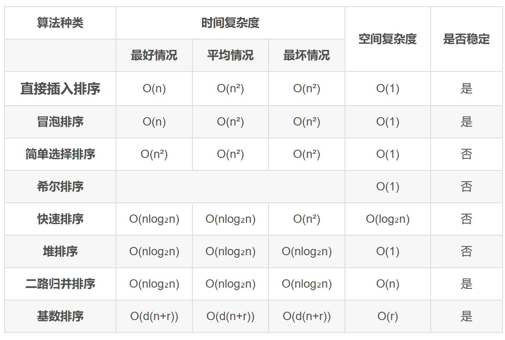

# 第8章 排序

## 1.总览

1. **比较类排序**：通过比较来决定元素间的相对次序，由于其时间复杂度不能突破O(nlogn)，因此也称为非线性时间比较类排序。 包括插入排序、希尔排序、选择排序、堆排序、冒泡排序、快速排序和归并排序。
   
2. **非比较类排序**：不通过比较来决定元素间的相对次序，它可以突破基于比较排序的时间下界，以线性时间运行，因此也称为线性时间非比较类排序。包括计数排序、桶排序和基数排序。
   
- **稳定**：如果a原本在b前面，若a=b，那么排序之后a仍然在b的前面。
- **不稳定**：如果a原本在b前面，若a=b，那么排序之后a可能在b的后面。


---
## 2.内部排序算法介绍

### 2.1 插入排序

类似于打扑克牌，插入排序是一种最简单直观的排序算法，它的工作原理是通过构建有序序列，对于未排序数据，在已排序序列中从后向前扫描，找到相应位置并插入。

#### 2.1.1 直接插入排序

**算法思想**
1. 将第一待排序序列第一个元素看做一个有序序列，把第二个元素到最后一个元素当成是未排序序列。
2. 从头到尾依次扫描未排序序列，将扫描到的每个元素插入有序序列的适当位置。（如果待插入的元素与有序序列中的某个元素相等，则将待插入元素插入到相等元素的后面。）

**复杂度分析**

- 时间复杂度：O(n²)
- 空间复杂度：O(1)

```C++
// 直接插入排序
int a[N];
void insert_sort()
{
	for (int i = 2; i <= n; i ++)
	{
		int val = a[i], j;
		for (j = i; j > 1 && a[j - 1] > val; j --)
			a[j] = a[j - 1];
		a[j] = val;
	}
}
```

**动图演示**


#### 2.1.2 折半插入排序

插入排序和冒泡排序一样，也有一种优化算法，叫做拆半插入。

**算法思想**

在直接插入排序算法中，总是边比较边移动元素，可以将比较和移动操作分离，即先折半查找出元素的待插入位置，然后统一地移动待插入位置之后的所有元素。

**复杂度分析**

- 时间复杂度：O(n²)
- 空间复杂度：O(1)

```C++
// 折半插入排序
int a[N];
void halfway_insert_sort()
{
	for (int i = 2; i <= n; i ++)
	{
		int val = a[i];
		// 需要找到第一个大于a[i]的数的位置
		int l = 1, r = i;
		while (l < r)
		{
			int mid = l + r >> 1;
			if (a[mid] <= val) l = mid + 1;
			else r = mid;
		}
		// 将[r, i - 1]之间的数移动到[r + 1, i]
		for (int j = i; j > r; j --)
			a[j] = a[j - 1];
		a[r] = val;
	}
}
```

- 折半插入排序仅减少了比较元素的次数，但元素的移动次数并未改变，时间复杂度仍为O(n<sup>2</sup>)。

#### 2.1.3 希尔排序（缩小增量排序）

**算法思想**

希尔排序，也称递减增量排序算法，是插入排序的一种更高效的改进版本。但希尔排序是**非稳定**排序算法。

希尔排序是基于插入排序的以下两点性质而提出改进方法的：

- 插入排序在对几乎已经排好序的数据操作时，效率高，即可以达到线性排序的效率；
- 但插入排序一般来说是低效的，因为插入排序每次只能将数据移动一位；

希尔排序的基本思想是：先将整个待排序的记录序列分割成为若干子序列分别进行直接插入排序，待整个序列中的记录“基本有序”时，再对全体记录进行依次直接插入排序。

**算法步骤**

1. 选择一个增量序列 t1，t2，……，tk，其中 ti > tj, tk = 1；
2. 按增量序列个数 k，对序列进行 k 趟排序；
3. 每趟排序，根据对应的增量 ti，将待排序列分割成若干长度为 m 的子序列，分别对各子表进行直接插入排序。仅增量因子为 1 时，整个序列作为一个表来处理，表长度即为整个序列的长度。

**复杂度分析**

- 时间复杂度：希尔排序的时间复杂度会随着ti选取策略的不同而发生变化，但是通常保持在O(n<sup>1.3</sup>)~O(n<sup>1.5</sup>)
- 空间复杂度：O(1)

```C++
// 希尔排序
int a[N];
void shell_sort()
{
	for (int gap = n / 2; gap; gap /= 2)
		for (int i = gap + 1; i <= n; i ++)
			if (a[i] < a[i - gap])
			{
				int val = a[i], j;
				for (j = i - gap; j > 0 && val < a[j]; j -= gap)
					a[j + gap] = a[j];
				a[j + gap] = val;
			}
}
```

**动图演示**


---
### 2.2 交换排序

所谓交换，是指根据序列中两个元素关键字的比较结果来对换这两个记录在序列中的位置。

#### 2.2.1 冒泡排序

冒泡排序是一种**稳定**的排序算法。

**算法思想**
1. 比较相邻的元素。如果第一个比第二个大，就交换它们两个
2. 对每一对相邻元素作同样的工作，从开始第一对到结尾的最后一对，这样在最后的元素应该会是最大的数；
3. 针对所有的元素重复以上的步骤，除了最后一个；
4. 重复步骤1~3，直到排序完成。

**复杂度分析**

- 时间复杂度：O(n²)
- 空间复杂度：O(1)

```C++
// 冒泡排序
int a[N];
void bubble_sort()
{
	for (int i = n; i > 1; i --)
		for (int j = 1; j < i; j ++)
			if (a[j] > a[j + 1])
				swap(a[j], a[j + 1]);
}
```

**动图演示**


#### 2.2.2 快速排序

快速排序是由东尼·霍尔所发展的一种排序算法。在平均状况下，排序 n 个项目要 Ο(nlogn) 次比较。在最坏状况下则需要 Ο(n²) 次比较，但这种状况并不常见。事实上，快速排序通常明显比其他 Ο(nlogn) 算法更快，因为它的内部循环（inner loop）可以在大部分的架构上很有效率地被实现出来。

快速排序使用分治法（Divide and conquer）策略来把一个串行（list）分为两个子串行（sub-lists）。

快速排序的最坏运行情况是 O(n²)，比如说顺序数列的快排。但它的平摊期望时间是 O(nlogn)，且 O(nlogn) 记号中隐含的常数因子很小，比复杂度稳定等于 O(nlogn) 的归并排序要小很多。所以，对绝大多数顺序性较弱的随机数列而言，快速排序总是优于归并排序。

- 在递归的过程中，并不产生有序子序列，但每趟排序后会将枢轴（基准）元素放到其最终的位置上。

**算法思想**
1. 从数列中挑出一个元素，称为 “基准”（pivot）;
2. 重新排序数列，所有元素比基准值小的摆放在基准前面，所有元素比基准值大的摆在基准的后面（相同的数可以到任一边）。在这个分区退出之后，该基准就处于数列的中间位置。这个称为分区（partition）操作;
3. 递归地（recursive）把小于基准值元素的子数列和大于基准值元素的子数列排序；

**复杂度分析**

- 时间复杂度：O(nlogn)
- 空间复杂度：O(logn)，递归栈的平均深度为logn

```C++
// 快速排序
int a[N];
void quick_sort(int l, int r)
{
	if (l >= r) return ;

	int k = a[l + r >> 1], i = l - 1, j = r + 1;
	while (i < j)
	{
		do i ++; while (a[i] < k);
		do j --; while (a[j] > k);
		if (i < j) swap(a[i], a[j]);
	}
	quick_sort(l, j);
	quick_sort(j + 1, r);
}
```

**动图演示**


**算法改进**

1. 随机法选择枢轴元素
2. 选择待排序数组的中间位置的数作为枢轴元素

### 2.3 选择排序

选择排序的基本思想是：每一趟（如第 i 趟）在后面 n - i + 1 个待排序元素中选取关键字最小的元素，作为有序子序列的第 i 个元素，直到第 n - 1 趟遍历完。

#### 2.3.1 简单选择排序

每次选择一个最小的元素与其进行交换。

**复杂度分析**

- 时间复杂度：O(n²)
- 空间复杂度：O(1)

```C++
// 简单选择排序
int a[N];
void select_sort()
{
	for (int i = 1; i < n; i ++)
	{
		int id = i;  // 记录最小值对应的数组下标
		for (int j = i + 1; j <= n; j ++)
			if (a[j] < a[id]) id = j;
		swap(a[i], a[id]);
	}
}
```

#### 2.3.2 堆排序

堆排序（Heapsort）是指利用堆这种数据结构所设计的一种排序算法。堆积是一个近似完全二叉树的结构，并同时满足堆积的性质：即子结点的键值或索引总是小于（或者大于）它的父节点。

堆排序可以说是一种利用堆的概念来排序的选择排序。分为两种方法：
1. 大顶堆：每个节点的值都大于或等于其子节点的值，在堆排序算法中用于升序排列；
2. 小顶堆：每个节点的值都小于或等于其子节点的值，在堆排序算法中用于降序排列；

**算法思想**
1. 创建一个堆 H[0……n-1]；
2. 把堆首（最大值）和堆尾互换；
3. 把堆的尺寸减 1，并调用 down(1)，目的是把新的数组顶端数据调整到相应位置；
4. 重复步骤 2，直到堆的尺寸为 1。

**复杂度分析**

- 时间复杂度：O(nlogn)
- 空间复杂度：O(1)

```C++
// 小根堆排序
int heap[N], len;

void down(int u)
{
	int t = u;
	if (2 * u <= len && heap[2 * u] < heap[t]) t = 2 * u;
	if (2 * u + 1 <= len && heap[2 * u + 1] < heap[t]) t = 2 * u + 1;
	if (t != u)
	{
		swap(heap[t], heap[u]);
		down(t);
	}
}

void heap_sort()
{
	for (int i = len / 2; i; i --) down(i);
	int n = len;
	while (n --)
	{
		cout << heap[1] << " ";
		heap[1] = heap[len --];
		down(1);
	}
}
```

**动图演示**


### 2.4 归并排序和基数排序

#### 2.4.1 归并排序

归并排序（Merge sort）是建立在归并操作上的一种有效的排序算法。该算法是采用分治法（Divide and Conquer）的一个非常典型的应用。

作为一种典型的分而治之思想的算法应用，归并排序的实现有两种方法：

1. 自上而下的递归（所有递归的方法都可以用迭代重写，所以就有了第 2 种方法）；
2. 自下而上的迭代；

和选择排序一样，归并排序的性能不受输入数据的影响，但表现比选择排序好的多，因为始终都是 O(nlogn) 的时间复杂度。代价是需要额外的内存空间。

**算法思想**
1. 申请空间，使其大小为两个已经排序序列之和，该空间用来存放合并后的序列；
2. 设定两个指针，最初位置分别为两个已经排序序列的起始位置
3. 比较两个指针所指向的元素，选择相对小的元素放入到合并空间，并移动指针到下一位置
4. 重复步骤3直到某一指针达到序列尾；
5. 将另一序列剩下的所有元素直接复制到合并序列尾。

**复杂度分析**

- 时间复杂度：O(nlogn)
- 空间复杂度：O(n)

```C++
// 归并排序
int a[N], tmp[N];
void merge_sort(int l, int r)
{
	if (l >= r) return ;

	int mid = l + r >> 1;
	merge_sort(l, mid);
	merge_sort(mid + 1, r);

	int k = 0, i = l, j = mid + 1;
	while (i <= mid && j <= r)
		if (a[i] <= a[j]) tmp[++ k] = a[i ++];
		else tmp[++ k] = a[j ++];

	while (i <= mid) tmp[++ k] = a[i ++];
	while (j <= r) tmp[++ k] = a[j ++];

	for (i = l, j = 1; j <= k; i ++, j ++)
		a[i] = tmp[j];
}
```

**动图演示**


#### 2.4.2 基数排序

基数排序是一种很特别的排序方法，它不基于比较和移动进行排序，而基于关键字各位的大小进行排序。借助多关键字排序的思想对单逻辑关键字进行排序。

**最高位优先法（MSD）**

1. 先对最高位关键字k1（如花色）排序，将序列分成若干子序列，每个子序列有相同的k1值；
2. 然后让每个子序列对次关键字k2（如面值）排序，又分成若干更小的子序列；
3. 依次重复，直至就每个子序列对最低位关键字kd排序；
4. 最后将所有子序列依次连接在一起成为一个有序序列

**最低位优先法（LSD）**
1. 从最低位关键字kd起进行排序，然后再对高一位的关键字排序
2. 依次重复，直至对最高位关键字k1排序后，便成为一个有序序列

**链式基数排序**

假如多关键字的记录序列中，每个关键字的取值范围相同，则按LSD法进行排序时，可以采用“分配-收集”的方法，其好处是不需要进行关键字间的比较。

对于数字型或字符型的单关键字，可以看成是由多个数位或多个字符构成的多关键字，此时可以采用这种“分配-收集”的办法进行排序，称作基数排序法。

- 首先按其 “个位数”  取值分别为 0, 1, …,  9“分配” 成 10 组，之后按从 0 至 9 的顺序将  它们 “收集” 在一起；
- 然后按其 “十位数”  取值分别为 0, 1, …, 9 “分配” 成 10 组，之后再按从 0 至 9 的顺序将它们 “收集” 在一起；
- 最后按其“百位数”重复一遍上述操作。

**复杂度分析**

- 时间复杂度：需要进行 d 次分配和收集，一趟分配需要O(n)，一趟收集需要O(r)，所以时间复杂度为O(d(n + r))，与序列的初始状态无关
- 空间复杂度：一趟排序需要的辅助存储空间为 r （r个队列），以后的排序会重复使用这些队列，所以为O(r)

```C++
// 基数排序
int a[N];
vector<int> q[10];

void radix_sort()
{
	// 找出最大值 确定要进行多少轮排序
	int mx = a[1];
	for (int i = 2; i <= n; i ++)
		if (a[i] > mx) mx = a[i];
	// 计算最大数字是几位数
	int len = to_string(mx).length();
	// len轮分配和收集
	int k = 1;
	while (len --)
	{
		for (int i = 1; i <= n; i ++)
		{
			int digit = a[i] / k % 10;
			q[digit].push_back(a[i]);
		}
		// 把队列中存放的数字取出来
		int cnt = 1;
		for (int i = 0; i < 10; i ++)
		{
			for (auto t : q[i])
				a[cnt ++] = t;
			q[i].clear();
		}
		k *= 10;
	}
}
```

**动图演示**


## 3.内部排序算法的比较及应用

### 3.1 内部排序算法的比较

#### 从时间复杂度比较

- 直接插入排序、冒泡排序、简单选择排序是三种简单的排序方法，时间复杂度都为O(n²)，且实现方法较简单，但直接插入排序和冒泡排序最好情况下的时间复杂度可以到达O(n)，而简单选择排序与序列的初始状态无关。
- 希尔排序作为插入排序的拓展，对较大规模的排序都可以达到很高的效率，但目前未得出其精确的渐近时间。
- 堆排序利用了一种称为堆的数据结构，可以在线性时间内完成建堆，且在 O(nlog₂n)内完成排序过程。
- 快速排序基于分治的思想，虽然最坏情况下的时间复杂度会达到 O(n²)，但快速排序的平均性能可以达到 O(nlog₂n)，在实际应用中常常优于其他排序算法。
- 归并排序同样基于分治的思想，但由于其分割子序列与初始序列的排列无关，因此它的最好、最坏和平均时间复杂度均为 O(nlog₂n)。

#### 从空间复杂度比较

- 简单选择排序、插入排序、冒泡排序、希尔排序和堆排序都仅需借助常数个辅助空间。
- 快速排序需要借助一个递归工作栈，平均大小为 O(log₂n)，当然在最坏情况下可能会增长到 O(n)。
- 二路归并排序在合并操作中需要借助较多的辅助空间用于元素复制,大小为 O(n),虽然有方法能克服这个缺点，但其代价是算法会很复杂而且时间复杂度会增加。

#### 从稳定性比较

- 插入排序、冒泡排序、归并排序和基数排序是稳定的排序算法，而简单选择排序、快速排序、希尔排序和堆排序都是不稳定的排序算法。
- 平均时间复杂度为 O(nlog₂n)的稳定排序算法只有归并排序，对于不稳定的排序算法，只需举出一个不稳定的实例即可。
- 对于排序算法的稳定性，读者应能从算法本身的原理上去理解，而不应拘泥于死记硬背。

#### 从适用性比较

- 折半插入排序、希尔排序、快速排序和堆排序适用于顺序存储。
- 直接插入排序、冒泡排序、简单选择排序、归并排序和基数排序既适用于顺序存储，又适用于链式存储。



### 3.2 内部排序算法的应用

#### 选取排序算法时需要考虑的因素

1. 待排序的元素个数 n。
2. 待排序的元素的初始状态。
3. 关键字的结构及其分布情况。
4. 稳定性的要求。
5. 存储结构及辅助空间的大小限制等。

#### 排序算法小结

1. 若 n 较小，可采用直接插入排序或简单选择排序。由于直接插入排序所需的记录移动次数较简单选择排序的多，因此当记录本身信息量较大时，用简单选择排序较好。
2. 若文件的初始状态已按关键字基本有序，则选用直接插入或冒泡排序为宜。
3. 若n较大，应采用时间复杂度为 O(nlog₂n)的排序算法：快速排序、堆排序或归并排序。
	- 当待排序的关键字随机分布时，快速排序被认为是目前基于比较的内部排序算法中最好的算法。
	- 堆排序所需的辅助空间少于快速排序，且不会出现快速排序可能的最坏情况，这两种排序都是不稳定的。
	- 若要求稳定且时间复杂度为 O(nlog₂n)，可选用归并排序。
4. 在基于比较的排序算法中，每次比较两个关键字的大小之后，仅出现两种可能的转移，因此可以用一棵二叉树来描述比较判定过程。由此可以证明：当文件的n个关键字随机分布时，任何借助于“比较”的排序算法，至少需要 O(nlog₂n)的时间。
5. 若n很大，记录的关键字位数较少且可以分解时，采用基数排序较好。
6. 当记录本身信息量较大时，为避免耗费大量时间移动记录，可用链表作为存储结构。

> https://blog.csdn.net/qq_64017312/article/details/139486413